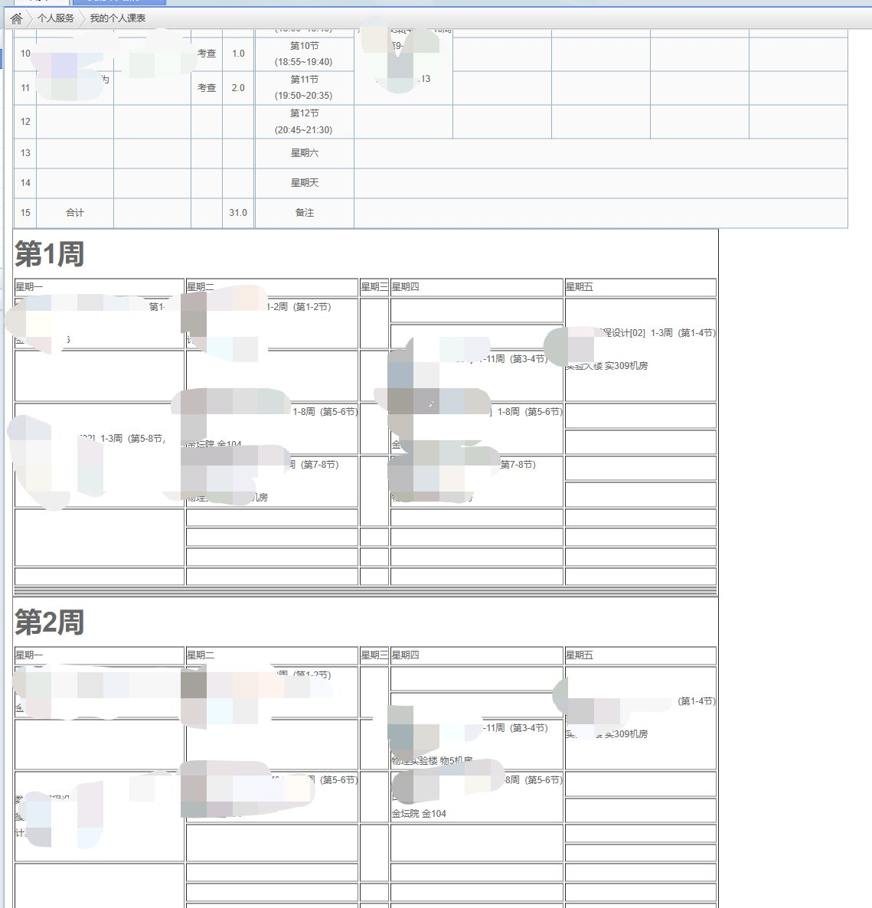

# 成贤课表优化工具

针对不想使用超级课程表APP但又想要优雅的课表显示的同学们，开发了这个工具

使用脚本将课表解析成每周的课表，方便查看

效果图

**油猴插件版**

功能：
- 课表优化显示
- 下载当前课表

安装方法：
1. 在油猴管理界面新建插件
2. 将目录`/tampermonkey`下的`index.js`的内容复制到新建插件的编辑框中并保存
3. 打开成贤学院课表页面即可看到效果

使用方法：
打开课表页面后，会显示`下载当前课表`和`课表显示优化`两个按钮
- `下载当前课表`：点击后会下载当前课表的html文件，可用于离线查看
- `课表显示优化`：解析课表并在页面下方展示每周的课表

> 点击`课表显示优化`后下载课表会将解析后的课表也保存到文件中，方便查看

**npm包版**

开发中，敬请期待

